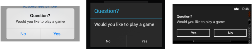

# How to Display Alert / Popup Message in Xamarin.Forms

### Displaying an alert or asking a user to make a choice is a common UI task. Xamarin.Forms has two methods on the Page class for interacting with the user via a pop-up: DisplayAlert and DisplayActionSheet. They are rendered with appropriate native controls on each platform.

<br/><br/>

## Displaying an Alert
`
All Xamarin.Forms-supported platforms have a modal pop-up to alert the user or ask simple questions of them. To display these alerts in Xamarin.Forms, use the DisplayAlert method on any Page. The following line of code shows a simple message to the user:
`
``` cs
DisplayAlert ("Alert", "Message", "OK");
```


`
This example does not collect information from the user. The alert displays modally and once dismissed the user continues interacting with the application.
`

<br/><br/>

### The **DisplayAlert** method can also be used to capture a user's response by presenting two buttons and returning a **boolean**. To get a response from an alert, supply text for both buttons and await the method. After the user selects one of the options the answer will be returned to your code. Note the **async** and **await** keywords in the sample code below:

``` cs
        private async void displayAlertBtn_Clicked(object sender, EventArgs e)
        {
            var alert = await DisplayAlert("Title", "Message", "Ok","Cancel");

            if (alert == true)
            {
                // if 'Ok' pressed Do Something here
            }
            else if (alert == false)
            {
                // if 'Cancel' pressed Do Something here
            }
        }
```



<br/><br/>

## Complete Code
`MainPage.xaml`

``` html
<?xml version="1.0" encoding="utf-8" ?>
<ContentPage xmlns="http://xamarin.com/schemas/2014/forms"
             xmlns:x="http://schemas.microsoft.com/winfx/2009/xaml"
             xmlns:local="clr-namespace:DisplayAlert"
             x:Class="DisplayAlert.MainPage">

    <StackLayout VerticalOptions="Center">
        <Button Text="Display Alert" x:Name="displayAlertBtn" Clicked="displayAlertBtn_Clicked"></Button>
    </StackLayout>

</ContentPage>
```
<br/>

`MainPage.xaml.cs`

``` cs

using System;
using System.Collections.Generic;
using System.Linq;
using System.Text;
using System.Threading.Tasks;
using Xamarin.Forms;

namespace DisplayAlert
{
    public partial class MainPage : ContentPage
    {
        public MainPage()
        {
            InitializeComponent();
        }

        private async void displayAlertBtn_Clicked(object sender, EventArgs e)
        {
            var alert = await DisplayAlert("Title", "Message", "Ok","Cancel");

            if (alert == true)
            {
                // if 'ok' pressed Do Something here
            }
            else if (alert == false)
            {
                // if 'Cancel' pressed Do Something here
            }

        }
    }
}
```
